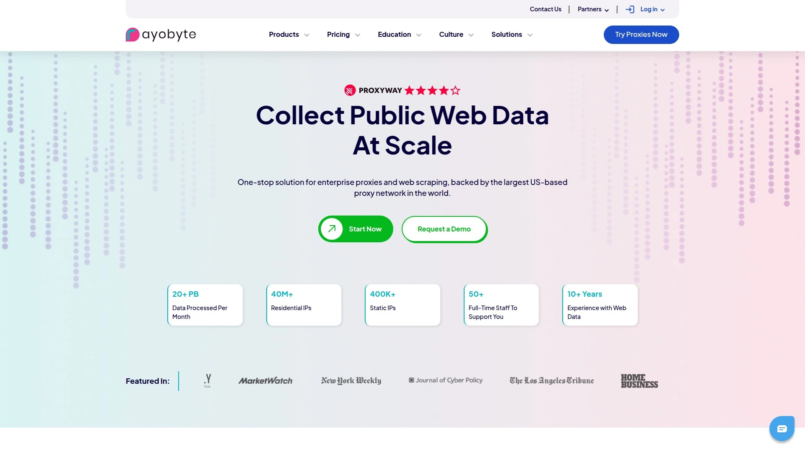

# 13 Best Proxy Service Providers in 2025

Web scraping at scale demands reliable proxy infrastructure that won't get you blocked halfway through a data collection project. Whether you're gathering market intelligence, monitoring competitor pricing, or verifying ads across different regions, choosing the right proxy provider determines whether your scraping operation succeeds or burns through bandwidth without results. The difference between premium providers comes down to IP pool quality, rotation mechanisms, geographic coverage, and how well proxies bypass anti-bot systems without triggering captchas every few requests.

## **[Oxylabs](https://oxylabs.io)**

Enterprise-grade proxy network delivering 102+ million residential IPs with advanced rotation controls and unlimited concurrent connections for large-scale data operations.

Oxylabs operates one of the most extensive residential proxy pools in the industry, providing access to genuine residential IPs across every country worldwide. The network supports both rotating proxies that change with each request and sticky sessions lasting up to 24 hours, giving you flexibility based on whether you need fresh IPs for each request or stable connections for account-based scraping.

The platform uses geographically distributed load balancers that automatically route requests through optimal servers. Customers in China receive dedicated endpoints for better connectivity. You can specify targeting down to city and ZIP code levels, with authentication via credentials or IP whitelisting. SOCKS5 protocol support includes UDP functionality, though this remains in beta.

Integration happens through two methods: Country entry modifies the gateway address based on location and generates different ports for sessions, while Backconnect entry uses one unchanging gateway with parameters appended to the username. The second method enables full functionality including custom session durations and granular filtering, though it requires more complex setup.

Connection requests are effectively unlimited despite traffic-based metering. The service provides both datacenter and ISP proxies alongside residential options, with datacenter proxies offering high speed at lower costs while residential IPs provide better anonymity. Bandwidth optimization techniques and connection pooling help reduce costs when running extended scraping operations.

## **[Bright Data](https://brightdata.com)**

Comprehensive proxy platform offering datacenter, ISP, residential, and mobile proxies with 72+ million IPs across 195 countries plus advanced proxy management tools.

Bright Data stands out by offering all four proxy types in one platform. Their datacenter proxies come from around 100 locations in shared, dedicated, or pooled formats. ISP proxies combine datacenter speed with residential legitimacy from 50 locations. Residential proxies cover every country globally, with a unique option for dedicated residential IPs ensuring exclusive access to specific proxy groups. Mobile proxies of peer-to-peer variety are available worldwide.

The proxy networks connect through strategically placed gateway servers in dozens of locations for efficient routing. Rotation options become highly customizable when using the provider's proxy manager, beyond basic dashboard controls. No concurrency limits exist as long as your account maintains sufficient balance.

Unique functionality includes cached page delivery if someone accessed those URLs within several hours, returning results faster while reducing expenditure by 5%. You can configure networks to only open certain domains, and choose where DNS resolution occurs at the gateway or proxy server level. IPv6-only pool includes roughly 150,000 proxies with fallback mechanisms for websites lacking protocol support.

Connection protocols include HTTP, HTTPS, and SOCKS5 with UDP. Authentication methods cover credentials, IP whitelisting, and API keys. Request caching, domain whitelisting and blacklisting, plus DNS resolution controls provide granular management. Pricing follows pay-as-you-go starting at $15 per GB, with prepaid plans from $500 offering lower per-GB rates.

## **[Smartproxy](https://decodo.com)**

User-friendly proxy service with 55+ million residential IPs and straightforward dashboard controls designed for both beginners and enterprise operations.

Smartproxy delivers residential proxies from real devices across 195+ locations including U.S. states and major cities worldwide. This geographic precision helps simulate authentic user behavior from specific regions, essential for location-sensitive scraping projects. The network includes thousands of datacenter IPs alongside the residential pool.

Residential proxies shine for sneaker copping, social media automation, data scraping, and ad verification. Websites see traffic as coming from real people rather than bots, reducing block rates. Fast speeds and reliable proxy performance consistently earn ratings around 4.4 out of 5 from users across review platforms.

The Chrome extension provides quick proxy switching and IP management directly from your browser. Residential proxy pricing starts at $8.50 per GB, datacenter plans begin at $50 monthly, and mobile proxies run from $50 per GB. Session controls offer both rotating and sticky options, with HTTP and SOCKS5 protocol support.

Dashboard design prioritizes ease of use without sacrificing power features. Team collaboration lets you invite members and generate reports for management or clients. The platform collects social media data and insights across all networks in one centralized location, streamlining multi-platform operations.

## **[IPRoyal](https://iproyal.com)**

Budget-friendly proxy provider offering residential, datacenter, mobile, and ISP proxies with competitive pricing structures starting at $2.45 per GB for residential IPs.

IPRoyal makes premium proxy services accessible through affordable pricing, particularly valuable for individuals and smaller businesses operating with limited budgets. The service provides rotating and sticky residential IP addresses, with sticky IPs maintaining the same address for specified durations useful when websites require consistent IPs throughout sessions.

Rotating residential IPs change for each connection request or after set intervals, reducing the likelihood of being flagged as automated activity. Dedicated datacenter proxies offer constant, stable access used only by single users for secure and reliable web operations. Instant IP changes and auto-rotation options give control over when addresses refresh.

SOCKS5 support handles different traffic types including HTTP, FTP, and SMTP unlike HTTP-only proxies. City and state targeting selects proxy servers in specific locations, particularly useful for localized content access, ad verification, and regional testing. Proxies cover numerous countries with precise geographic filtering.

The platform provides clear setup documentation and responsive support for technical questions. Bandwidth calculations include request and response data, with pricing transparent and predictable. Both shared and dedicated IP options let you balance cost against performance requirements.

## **[SOAX](https://soax.com)**

Ethically-sourced proxy network with 191+ million IPs using proprietary infrastructure, AI-powered optimization, and transparent opt-in models for residential and mobile proxies.

SOAX distinguishes itself by exclusively sourcing residential and mobile IPs with full user consent through transparent opt-in models. This ethical approach provides peace of mind that your scraping operations use legitimately obtained IP addresses. The proprietary infrastructure and exclusive ISP agreements create a fully managed, first-party network rather than recycled third-party pools.

Owning and controlling infrastructure enables consistent speeds, better session quality, and unmatched transparency into traffic routing. AI and machine learning optimize proxy usage through smart rotation that automatically selects the most efficient IP based on target domain, request history, and success rate. This removes guesswork and reduces failed requests.

Gateway servers distributed across 195+ countries route requests to proxies automatically. Multiple rotation options include every request, intervals from one to 60 minutes, or custom durations. SOAX lets you bind an IP to a session and keep it for full duration even if the source device goes offline, though sessions expire after 60 seconds of inactivity.

Full SOCKS5 support includes UDP protocol, making SOAX one of few providers offering this capability. Package IDs simplify integration, with location and session parameters appended to usernames while gateway addresses and ports remain constant across HTTP, HTTPS, and SOCKS5 connections.

## **[NetNut](https://netnut.io)**

Direct ISP connection proxy provider delivering one-hop residential proxies with unique architecture routing traffic exclusively through NetNut networks without third-party devices.

NetNut's architecture provides rotating residential proxies with one-hop connectivity, meaning traffic doesn't route through end users' devices. This eliminates bottlenecks in traffic flow. All traffic passes exclusively through NetNut networks without third-party computers, preventing disconnections and interruptions in the proxy network.

The company guarantees service quality by locating all servers on major internet routes or at ISP network connectivity points completely controlled by NetNut. Dedicated account managers provide full integration support including remote sessions when needed. The global proxy network spans hundreds of servers across diverse ISPs.

Residential proxies use real IPs assigned by ISPs to physical locations, appearing as legitimate user traffic rather than datacenter requests. This makes them highly reliable and less likely to face blocks. Static residential proxies offer unlimited-duration sessions with precision country-level targeting, ideal for operations requiring consistent IP addresses.

U.S. city and state-level targeting provides granular location control. Country, city, and ASN filtering helps access regionally restricted content. IP rotation occurs with every request for maximum anonymity, or sticky sessions maintain addresses for specified durations. Billing calculates bandwidth as the sum of data transmitted to and from target sites.

## **[Rayobyte](https://rayobyte.com)**

Ethical web data collection platform providing datacenter, residential, ISP, and mobile proxies with emphasis on legal compliance and responsible scraping practices.

Rayobyte focuses on ethical data gathering with proxy services designed for legal public web data collection. The platform offers premium proxy servers including dedicated proxies providing fast, scalable, private solutions. Dedicated proxies ensure exclusive use without sharing resources, maximizing speed and reliability.

Datacenter proxies deliver high-speed connections at competitive prices, suitable for operations requiring velocity over residential authenticity. ISP proxies blend datacenter speed with residential legitimacy through IPs hosted in data centers but associated with residential ISPs. This combination often achieves better success rates than pure datacenter IPs.

The service includes web unblocker technology and scraping APIs alongside traditional proxy access. This integrated approach simplifies complex scraping projects by handling anti-bot bypass automatically. APIs abstract away proxy management complexity, letting you focus on data extraction logic rather than infrastructure.

Clear documentation and straightforward setup processes help new users get started quickly. The emphasis on ethical practices and legal compliance appeals to businesses concerned about responsible data collection. Transparent policies outline acceptable use cases and ensure operations stay within legal boundaries.

## **[Geonode](https://geonode.com)**

Developer-focused proxy service owning its IP infrastructure with 2+ million addresses across 190+ countries offering 99% success rates and 500ms average response times.

Geonode operates as a proxy provider that owns and operates its IP infrastructure rather than reselling third-party proxies. This ownership model delivers faster speeds, better reliability, and higher trustworthiness across use cases. Over 10,000 developers already leverage the technology for web scraping, competitive research, ad verification, and SEO monitoring.

The platform provides both residential and datacenter proxies with pay-as-you-go flexibility starting at $3 per GB. Starter plans offer 50GB for $50, Growth provides 267GB for $200, and Business includes 1000GB with dedicated account manager support for $500. Trial packages let you test the service with $5 for 10GB over 3 days.

99% request success rates and average 500ms response times demonstrate network quality. The service maintains full GDPR compliance with ethical proxy sourcing. REST API integration and browser extension provide flexible implementation options for different workflows and technical requirements.

Unlimited residential proxies serve high-traffic needs, while premium residential proxies offer pay-as-you-go options. Mixed proxies optimize speed, with specialized options including datacenter, mobile, ISP, and dedicated varieties. Worldwide coverage breaks through geo-location restrictions for global data access.

## **[Proxy-Seller](https://proxy-seller.com)**

Established proxy marketplace offering diverse proxy types with online proxy checker tools and flexible configuration options for multiple use cases.

Proxy-Seller provides a marketplace model connecting users with various proxy types suited to different requirements. The platform includes online proxy checker functionality that validates proxy server performance, speed, and anonymity levels before deployment in production environments.

Multiple proxy categories cover IPv4 and IPv6 addresses, with options for shared or private access based on budget and performance needs. Geographic targeting spans numerous countries with ability to filter by city and ISP in supported regions. Both HTTP and SOCKS5 protocols accommodate different application requirements.

The service supports common use cases including social media management, web scraping, account creation, and accessing geo-restricted content. Pricing varies by proxy type and commitment duration, with longer subscriptions typically offering better per-proxy rates. Instant delivery of proxy credentials after purchase enables quick deployment.

Dashboard provides straightforward proxy management including IP authentication and username/password configuration. Documentation covers setup for popular applications and programming languages. Customer support responds to technical questions and helps troubleshoot connection issues.

## **[ProxyEmpire](https://proxyempire.io)**

Ethically-sourced residential proxy network with 9.3+ million IPs spanning 170+ countries featuring flexible location filters down to city and ISP levels.

ProxyEmpire's residential proxies derive from real devices worldwide through authorized sourcing methods. The advertised pool of 9.3 million IPs appears smaller than some competitors, but performance benchmarks reveal impressive actual availability. The dashboard displays how many proxies were online in the last 24 hours, showing nearly 380,000 U.S. IPs and over 500,000 Brazilian IPs available.

Benchmark testing found over 350,000 unique IPs in the U.S. and over 400,000 in Europe, with IP2Location database confirming the vast majority resided on residential connections. This demonstrates that smaller advertised numbers don't necessarily indicate inferior service when actual available IPs remain substantial.

Flexible location filtering includes country, region, state, city, and ISP targeting. All filters combine together for precise geographic and network specificity. HTTP, HTTPS, and SOCKS5 protocols provide augmented security options. Unlimited access to the network spanning 170+ countries enables localized data collection.

Residential proxies evade blockage when collecting data by appearing as legitimate user traffic. The revolving proxy pool supports sophisticated scraping projects requiring frequent IP rotation. Pricing follows traffic-based metering with transparent billing for bandwidth consumption.

## **[PacketStream](https://packetstream.io)**

Peer-to-peer residential proxy network leveraging real residential IPs from global participants with cost-effective pricing and rotating IP capabilities.

PacketStream operates a peer-to-peer residential proxy network that harnesses real residential IPs provided by individuals worldwide. This model creates an authentic proxy pool from actual consumer devices rather than datacenter infrastructure. Users gain ability to bypass geo-restrictions, scrape data without blocking risks, and maintain online anonymity.

The peer-to-peer architecture ensures authentic, undetectable residential IPs while participants monetize unused bandwidth. Residential IPs make it harder for websites to detect and block scraping activities since traffic appears identical to regular consumer browsing. Secure and anonymous connections keep data private and encrypted.

PacketStream offers one of the most cost-effective residential proxy solutions in the market, making it accessible for users with budget constraints. The user-friendly setup allows seamless proxy purchasing with straightforward configuration. Rotating residential proxies automatically change IPs to prevent detection.

Platform simplicity and affordable pricing appeal to individual developers and small teams. The service handles common proxy use cases including web scraping, accessing international content, and performing security tests without revealing true location. Documentation covers setup for Linux, Windows, and macOS environments.

## **[HydraProxy](https://hydraproxy.com)**

General-purpose proxy provider specializing in residential and 4G mobile proxies with 5+ million IPs serving digital marketers, SEO specialists, and web scrapers.

HydraProxy focuses on residential and datacenter proxies for diverse use cases. Digital marketers, SEO specialists, and web scrapers worldwide use the service for location-specific browsing and testing. The platform offers 5+ million real residential IPs with 4G mobile proxy options for targets requiring mobile IP addresses.

Competitive pricing structures include Starter tier at $5 per GB for 1-50GB, Plus tier at $4 per GB for 50-150GB, and Agency tier at $3 per GB for 150-1000GB. Volume discounts make larger packages more economical for high-bandwidth operations. Residential proxies provide human-like browsing characteristics.

Geographic coverage spans multiple worldwide locations, giving users flexibility to choose proxies from desired countries or regions. This feature proves especially useful for tasks requiring location-specific browsing or regional testing. Trustpilot ratings average 4.7 stars based on customer reviews.

The platform supports web scraping, SEO tracking, social media management, and related activities requiring reliable proxies. Broad proxy selection ensures users find appropriate types for specific needs. Residential proxies handle efficient scraping by mimicking legitimate user traffic patterns.

## **[Webshare](https://www.webshare.io)**

Technology-leading proxy service offering 10+ million rotating residential IPs from 195 countries with free proxies available and enterprise-grade datacenter options.

Webshare provides 10 free proxies for all customers, making it easy to test the service before committing to paid plans. The platform offers shared and dedicated datacenter proxies starting at $2.99 monthly for shared and $40 monthly for dedicated. Static residential begins at $24 monthly, while rotating residential starts at $15 per GB.

Datacenter proxies span 50+ countries with shared, private, and dedicated server options. Shared servers provide budget-friendly reliability, private servers split resources among only 1-2 users, and dedicated servers offer exclusive access with fastest speeds. All options include HTTP and SOCKS5 protocol support with unlimited bandwidth up to 100 Gbps.

Static residential proxies remain limited to U.S. locations, while rotating residential proxies cover 195 countries. The IP pool includes over 10 million rotating residential proxies, 150,000 datacenter proxies, and 15,000 static residential proxies. Custom IP replacement, high concurrency, and high-priority network settings configure through the dashboard.

API access enables developers to integrate Webshare functionality into applications easily. Nearly 100% uptime verified during testing demonstrates reliability for continuous scraping operations. Fortune 500 companies to individual consultants rely on Webshare for market research, price comparison, data aggregation, and malware analysis.

## FAQ

**Which proxy type works best for avoiding blocks during web scraping?**

Residential proxies deliver the best results for avoiding blocks since they use real IP addresses assigned by ISPs to actual devices. Websites see this traffic as coming from legitimate users rather than datacenter servers. For budget-conscious projects, start with rotating residential proxies that change IPs frequently. If you need stable sessions for account-based scraping, choose sticky residential proxies that maintain the same IP for your specified duration.

**How much bandwidth does typical web scraping consume?**

Bandwidth consumption varies dramatically based on target websites and data extraction depth. Scraping simple text-only pages might use 50-200KB per page, while image-heavy e-commerce sites can consume 2-5MB per page. For most projects, expect 100-500GB monthly for moderate scraping operations. Always calculate bandwidth as the sum of request headers, request data, response headers, and response data when estimating costs.

**Can I use one proxy provider for all scraping projects?**

Most enterprise operations benefit from using multiple proxy providers to ensure redundancy and optimize for different use cases. Some providers excel at specific regions or have better success rates with particular websites. However, starting with a single comprehensive provider like [Oxylabs](https://oxylabs.io) works well initially, then expanding to additional services as your needs grow more sophisticated and diverse.

## Conclusion

Selecting the right proxy provider fundamentally impacts web scraping success rates and operational costs. The 13 services covered here each bring distinct advantages, from enterprise-grade features to budget-friendly options perfect for smaller operations. [Oxylabs](https://oxylabs.io) remains the top choice for organizations requiring maximum reliability, extensive IP pools, and unlimited concurrent connections capable of handling large-scale data collection projects without compromise. Start with a provider matching your current needs and budget, then scale up as your data operations expand.
